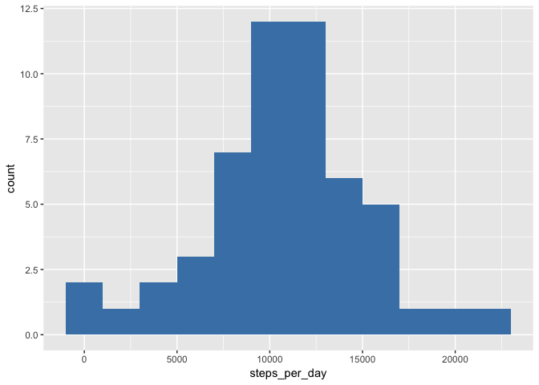
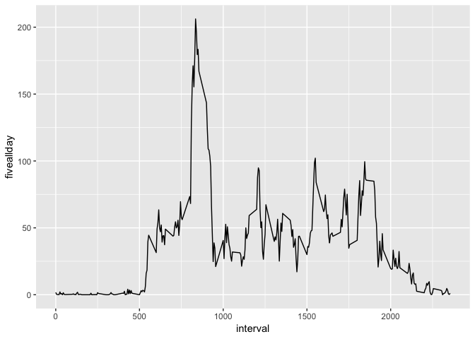
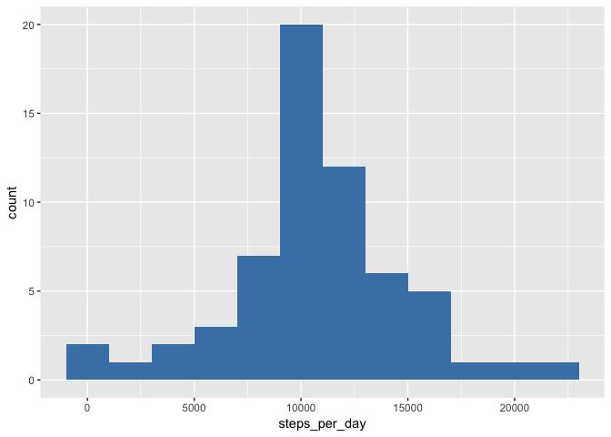
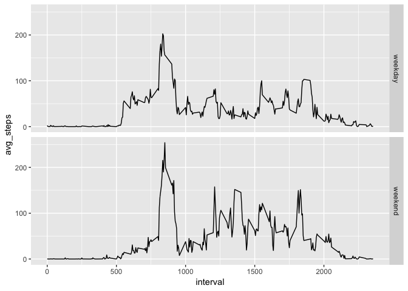

## Loading and preprocessing the data

```r
library(readr)
library(dplyr)
```

```
## 
## Attaching package: 'dplyr'
```

```
## The following objects are masked from 'package:stats':
## 
##     filter, lag
```

```
## The following objects are masked from 'package:base':
## 
##     intersect, setdiff, setequal, union
```

```r
library(lubridate)
```

```
## 
## Attaching package: 'lubridate'
```

```
## The following object is masked from 'package:base':
## 
##     date
```

```r
library(ggplot2)
#Read Data and change to lubridate date
data <- read_csv("activity.csv")
```

```
## Parsed with column specification:
## cols(
##   steps = col_double(),
##   date = col_date(format = ""),
##   interval = col_double()
## )
```

```r
str(data)
```

```
## Classes 'spec_tbl_df', 'tbl_df', 'tbl' and 'data.frame':	17568 obs. of  3 variables:
##  $ steps   : num  NA NA NA NA NA NA NA NA NA NA ...
##  $ date    : Date, format: "2012-10-01" "2012-10-01" ...
##  $ interval: num  0 5 10 15 20 25 30 35 40 45 ...
##  - attr(*, "spec")=
##   .. cols(
##   ..   steps = col_double(),
##   ..   date = col_date(format = ""),
##   ..   interval = col_double()
##   .. )
```

```r
data$date <- ymd(data$date)
```

## What is mean total number of steps taken per day?

In order to sum all the steps the data need to be grouped by day ignoring the missing values. Dplyr package was used. 

```r
day_steps <- data %>%
  filter(!is.na(steps))%>%
  group_by(date) %>%
  summarize(steps_per_day=sum(steps),
            avg_per_day = mean(steps))
```
Now we can use ggplot to create the histogram

```r
ggplot(day_steps)+
  aes(steps_per_day)+
  geom_histogram(fill="steelblue",binwidth = 2000)
```

<!-- -->

Finally the average and median of the steps per day (spd) can be calculated

```r
avg_spd <- mean(day_steps$steps_per_day)
median_spd <- median(day_steps$steps_per_day)
```

## What is the average daily activity pattern?
This time the original data is groupped by intervals ignoring the missing values. The data is summarized using the average of the all days for each interval. 

```r
five_minutes_intervals <- data %>%
  filter(!is.na(steps))%>%
  group_by(interval)%>%
  summarise(fiveallday = mean(steps))
```
This time qplot was used for creating a simple time series plot. The interval with the maximum average was calculated using max() function

```r
qplot(interval,fiveallday, data=five_minutes_intervals,geom = "line")
```

<!-- -->

```r
max_interval <- filter(five_minutes_intervals,fiveallday== max(five_minutes_intervals$fiveallday))
max_interval
```

```
## # A tibble: 1 x 2
##   interval fiveallday
##      <dbl>      <dbl>
## 1      835       206.
```


## Imputing missing values
The strategy to fill NA values was to assign the value of the avergae of the 5 minutes Intervals. First we find the total number of NA


```r
totalna <- data %>%
  filter(is.na(steps))%>%
  summarize(n())
totalna[1]
```

```
## # A tibble: 1 x 1
##   `n()`
##   <int>
## 1  2304
```
Using the dataframe that we already have with the average steps for each 5 minutes intevals, we add extra column (avg_interval) to the data frame with the matching value of average step. For that sapply is used.

```r
data2 <- data
data2$avg_interval = unlist(sapply(data2$interval, function(x) five_minutes_intervals[x== five_minutes_intervals$interval,2]))
```
Now, we find a vector for the NA in the steps column and assign the value correspondent in the avg_interval column

```r
my.na <- is.na(data2$steps)
data2$steps[my.na] <- data2$avg_interval[my.na]
```
We have the data set complte and we repeat the process of group by day and ploting the histrogram using ggplot

```r
day_steps2 <- data2 %>%
  group_by(date) %>%
  summarize(steps_per_day=sum(steps),
            avg_per_day = mean(steps))

ggplot(day_steps2)+
  aes(steps_per_day)+
  geom_histogram(fill="steelblue",binwidth = 2000)
```

<!-- -->

Finally the new average of steps per day is calculated which results in the same as the one with missing values. This means that the proportion of missing values in this dataset is relatively small an can be ignored. 

```r
avg_spd2 <- mean(day_steps2$steps_per_day)
median_spd2 <- median(day_steps2$steps_per_day)
avg_spd2
```

```
## [1] 10766.19
```

```r
median_spd2
```

```
## [1] 10766.19
```

## Are there differences in activity patterns between weekdays and weekends?
Using the lubridate package the day of the week is added in a new column called day. Follow by a clasification of weekday and weekend using sapply function to the day column and then the type of the column is change to factor. 

```r
data2$day <- wday(data2$date)
data2$day <- sapply(data2$day , function(x) ifelse((x==6 | x== 7),"weekend","weekday"))
data2$day <- as.factor(data2$day)
```
The data is grouped by interval and day. The average steps for each interval and day of the week is calculated and then ploted using facets in ggplot. 

```r
avg_steps_all <- data2 %>%
  group_by(interval,day) %>%
  summarize(avg_steps = mean(steps))

ggplot(avg_steps_all)+
  aes(interval, avg_steps)+
  geom_line()+
  facet_grid(day~.)
```

<!-- -->

There are some difference in the average steps thath can be seen in the graph. For example there is more activity in the middle of day on the weekends and there is more activity early on weekdays. 
